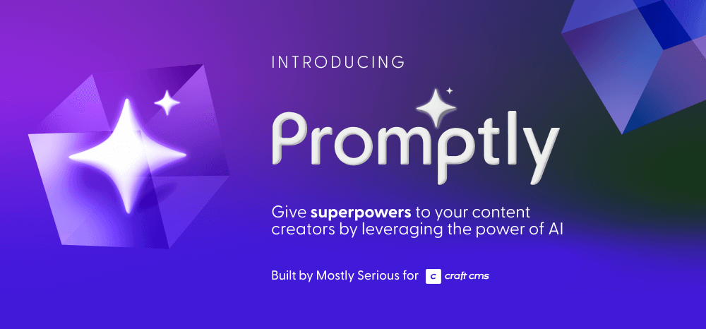
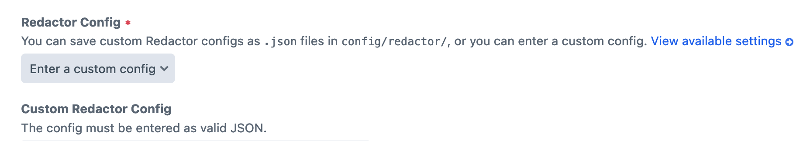

# Promptly



Revolutionize content creation in Craft by leveraging the power of AI, giving superpowers to your content creators to help them brainstorm and edit content with an AI assistant directly within Craft CMS.

> ‼️ For this initial release Promptly works only as a plugin for [Redactor](https://plugins.craftcms.com/redactor) in Craft CMS, but expanding Promptly to other field types is a top priority.

Looking to utilize Promptly on your project? Read our [blog post](https://www.mostlyserious.io/news-updates/promptly-bringing-chatgpt-to-craft-cms) on using Promptly.

## Features

Promptly offers four tailored prompt categories to help you manage your content:

- 🧠 **Brainstorm:** Craft tailored headlines, think of topic ideas, and solve the blank page problem by writing opening paragraphs.
- ✍🏼 **Edit:** Save time and money by leveraging AI to correct spelling and grammar, adjust the length of your content, translate languages, or change the tone of your writing.
- ⚡ **Custom Prompts:** Write your own prompts to generate any result you can dream up, without ever leaving Craft CMS.

**Built With Content in Mind**

The Brainstorm and Edit prompts are designed to ensure the results you receive from GPT are aligned with your existing content, and you can add keywords to help shape the response to your precise needs.

Using Custom Prompts, your options are nearly limitless. Here are just a few examples of what you can use AI to accelerate:

- **📚 Blogging:**
    - Generate a list of blog post topics based on customer pain points
    - Suggest new ways to approach a subject for fresh content
    - Suggest new topic ideas based on high performing posts
- **🌐 Website Content:**
    - Craft compelling product descriptions for your online store
    - Generate unique and informative FAQs your customers may ask
    - Brainstorm engaging calls-to-action to increase conversions
- **🛟 Knowledge Base / Help Center:**
    - Generate concise and informative how-to articles
    - Craft step-by-step guides for using products or services
    - Develop troubleshooting articles to address common issues
    

Install Promptly to add an AI assistant to elevate your content creation process, save time and money, and bring the advantages of AI directly into Craft CMS.

---

## Installation

You can install this plugin from the Plugin Store or with Composer.

**From the Plugin Store**  
Go to the Plugin Store in your project’s Control Panel and search for “Promptly”. Then click on the “Install” button in its modal window.

**With Composer**  
Open your terminal and run the following commands:

```shell
# go to the project directory
cd /path/to/my-project

# tell Composer to load the plugin
composer require mostlyserious/craft-promptly

# tell Craft to install the plugin
php craft plugin/install promptly
```

### Add to Redactor Field

**Config File**  
You can save custom Redactor configs as `.json` files in `/config/redactor` and add `"promptly"` to the array of `"plugins"` there.

**Inline Field Settings**



```json
{
    "plugins": [
        "promptly"
    ]
}
```

---

## Overriding Plugin Settings

If you create a config file in your `/config` folder called `promptly.php`, you can override the plugin's settings in the Control Panel. Since that config file is fully multi-environment aware, this is a handy way to have different settings across multiple environments.

Here’s what that config file might look like along with a list of all of the possible values you can override.

```php
<?php

use craft\helpers\App;

return [
    'openAiKey' => App::env('OPENAI_API_KEY'),
    'gptModel' => 'gpt-4' // or gpt-3.5-turbo
];
```

> ‼️ Promptly has been tested with `gpt-4` and `gpt-3.5-turbo` and these are the only two values available from the Control Panel. 
> However, any OpenAI GPT model that uses the `chat` endpoint should work and as of the time this writing includes: `gpt-4`, `gpt-4-0613`, `gpt-4-32k`, `gpt-4-32k-0613`, `gpt-3.5-turbo`, `gpt-3.5-turbo-0613`, `gpt-3.5-turbo-16k`, and `gpt-3.5-turbo-16k-0613`.

---

## OpenAI API Pricing

With the Promptly plugin, you'll have two separate costs: licensing for the plugin itself and another for the AI-generated content from OpenAI. The plugin provides seamless Craft integration with OpenAI's API, custom prompting, and a user-friendly interface. Please note that you'll be billed separately for content generated by OpenAI's API based on their pay-for-what-you-use model. You can [learn more about pricing](https://openai.com/pricing) and your [OpenAI API key](https://help.openai.com/en/articles/4936850-where-do-i-find-my-secret-api-key) on OpenAI's website.

---

## Short-Term Roadmap
* Adding tests
* Code-base refactoring & bug fixes
* Expanding functionality beyond Redactor
* Collecting community feedback
* Improved accessibility

---

[](https://mostlyserious.io)
